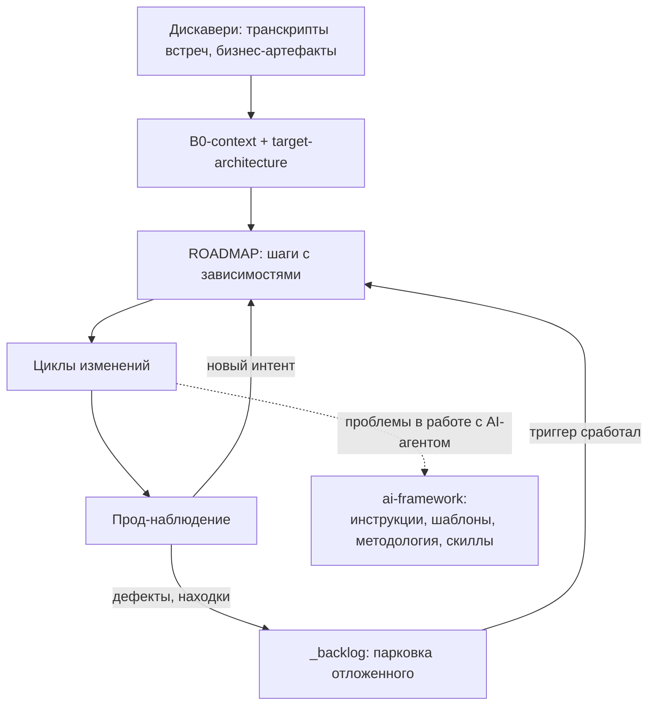
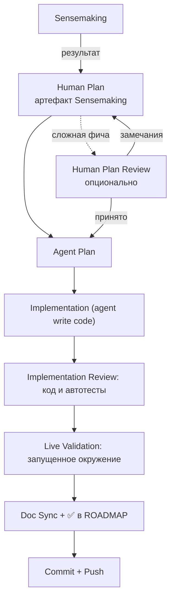

# Персональная методология Agentic Software Development

## Жизненный цикл проекта



1. **Дискавери** — из встреч и бизнес-артефактов рождаются `B0-context.md` и `target-architecture.md`.
2. **ROADMAP** — итеративный путь: шаги, выходы, зависимости.
3. **Циклы изменений** — по одному шагу ROADMAP, протокол ниже.
4. **Прод-наблюдение** — журнал и метрики прода; отсюда приходят дефекты и находки эксплуатации.
5. **Находки** — фиксируются в `_backlog.md`, если не входят в текущий scope; при наступлении условия возврата становятся шагом ROADMAP.

Две петли: продуктовая улучшает продукт; процессная фиксирует проблемы в работе с AI-агентом в обвязке — репозитории [Kromeshn/ai-framework](https://github.com/Kromeshn/ai-framework) — и улучшает Agentic Software Development: разработку, в которой выполнение этапов делегируется AI-агентам, а управление циклом остаётся за пользователем.

Проблема в работе с AI-агентом — ситуация, в которой действие агента расходится с намерением пользователя или правилами фреймворка и требует исправления либо дополнительного контроля. Проблема устраняется в текущем диалоге, а вывод, который должен влиять на будущую работу, фиксируется в репозитории [Kromeshn/ai-framework](https://github.com/Kromeshn/ai-framework): в инструкциях, методологии, шаблонах или скиллах. Повтор одной и той же проблемы указывает на пробел в протоколе; корректируется соответствующий артефакт.

---

## Цикл изменения

Код — источник правды о текущем состоянии системы; Human Plan — источник правды о принятом намерении и критерии приёмки, пишется до кода.

Норма полного цикла: один пункт ROADMAP → один Human Plan файл в `docs/` → один коммит. Цикл может длиться несколько сессий — непрерывность держит файл плана, не сессия.

Состав цикла определяется пользователем с учётом цены тихой ошибки и сложности изменения.

Каждый этап цикла запускается пользователем отдельно; несколько этапов объединяются только по явному указанию.



Косвенный показатель качества цикла — этап, на котором обнаруживается пропущенное решение. Чем позже возникает необходимость вернуться к Human Plan, тем выше стоимость неполноты исходной модели; ошибки реализации на Implementation Review и проблемы окружения на Live Validation остаются нормальными результатами своих этапов.

1. **Sensemaking** — совместный разбор до понимания: что меняется, зачем и как должно работать.
2. **Human Plan** — артефакт Sensemaking, который фиксирует сложившуюся модель фичи: компоненты, потоки, правила, состояния, последствия и проверку. Без кода и псевдокода.
3. **Human Plan Review** — опциональная независимая проверка плана на дыры, противоречия и неясный scope для сложных фич.
4. **Agent Plan** — финальный технический план в чате, разрабатывается агентом в `plan mode` на основании Human Plan. Ниже уровень абстракции; можно файлы, функции, тесты, порядок внедрения. Отдельно не ревьюится.
5. **Implementation (agent write code)** — агент пишет код по Agent Plan.
6. **Implementation Review** — другой агент проверяет код и diff по плану и запускает автоматические тесты, не переходя к проверке в запущенном окружении.
7. **Live Validation** — агент проверяет фичу в запущенном окружении по сценарию из Human Plan; при необходимости перезапускает контейнер или сервис.
8. **Doc Sync** — агент синхронизирует документацию (`/doc-sync-review`) и ставит ✅ шагу в `ROADMAP.md`.
9. **Commit + Push** — агент завершает цикл отдельным коммитом (`/git-commit`) и по явной команде пользователя отправляет его в remote.

Готовность Human Plan определяется не формальной полнотой разделов, а тем, достаточно ли определена ментальная модель фичи для перехода к Agent Plan. Практические ориентиры описаны в `/human-plan`.

Implementation Review проверяет diff кода. Human Plan Review — дополнительная точка контроля для сложных фич. Agent Plan отдельно не ревьюится.

## Скиллы по этапам

| Этап | Скилл | Агент |
|---|---|---|
| Human Plan | `/human-plan` | Claude |
| Human Plan Review (опционально) | `/human-plan-review` | Codex |
| Реализация (`.py` файлы) | `/dignified-python` | Codex |
| Implementation Review | `/implementation-review` | Claude |
| Синхронизация документации | `/doc-sync-review` | Claude/Codex |
| Коммит + Push | `/git-commit` | Claude/Codex |

Привязка «Агент» — типичная, не жёсткая: скиллы стоят байт-в-байт одинаково у Claude и Codex, код чаще пишет Codex.

---

## Артефакты документации

```
CLAUDE.md                    # Инструкции для Claude
AGENTS.md                    # То же для Codex
README.md                    # Входная дверь проекта
INSTALLATION.md              # Установка и деплой
docs/
├── B0-context.md            # Бизнес-контекст
├── target-architecture.md   # Целевая картина, временный
├── L1-architecture.md       # Архитектура системы
├── L2-functions.md          # Описание функций
├── ROADMAP.md               # Шаги проекта
├── _backlog.md              # Парковка отложенного
├── _methodology.md          # Этот файл, gitignored
├── <feature>.md             # Human Plan цикла
├── Business artifacts/      # Сырьё дискавери, gitignored
├── Meeting Transcripts/     # Транскрипты, gitignored
├── Meeting Protocols/       # Протоколы встреч
└── Archive/                 # Закрытое и отжившее
```

### Постоянные (живут в `docs/`)

| Файл | Содержит | Когда обновляется |
|---|---|---|
| `B0-context.md` | Бизнес-контекст: цель, домен (ключевые сущности и правила), известные ограничения | При смене бизнес-целей или scope |
| `L1-architecture.md` | Архитектура системы: компоненты, внешние системы, потоки данных | При структурных изменениях (добавлен компонент, поменялась интеграция) |
| `L2-functions.md` | Функции скрипта: входы, выходы, ветвления | После каждого изменения кода, затрагивающего контракт или логику функции |
| `ROADMAP.md` | Шаги проекта: что делаем, выход, зависимости, статусы | При дискавери и пересмотре пути; ✅ шагу при закрытии цикла |
| `_backlog.md` | Парковка отложенного вне активного scope: риски/дефекты и идеи, у каждого пункта условие возврата | Пункт добавляется при осознанном откладывании; уходит в работу, когда условие возврата наступило |

### Временные

| Файл | Содержит | Когда обновляется |
|---|---|---|
| `docs/<feature>.md` | Human Plan цикла; имя отражает суть фичи, структура задаётся `/human-plan` | Во время Sensemaking и опционального Human Plan Review; после закрытия цикла переезжает в `docs/Archive/` |
| `target-architecture.md` | Целевая архитектура на время построения системы | По мере реализации вливается в `L1-architecture.md` и архивируется |
