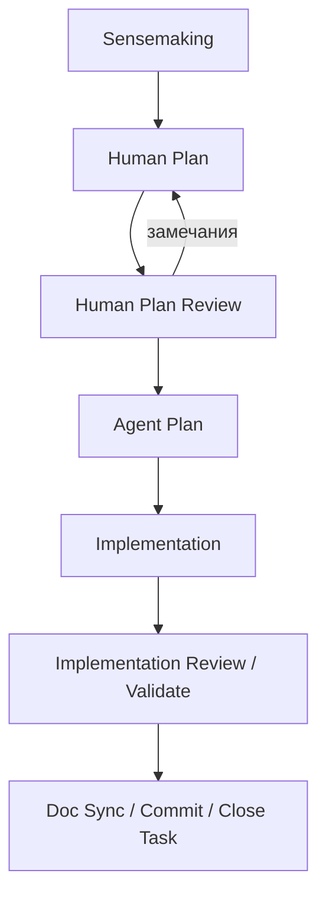
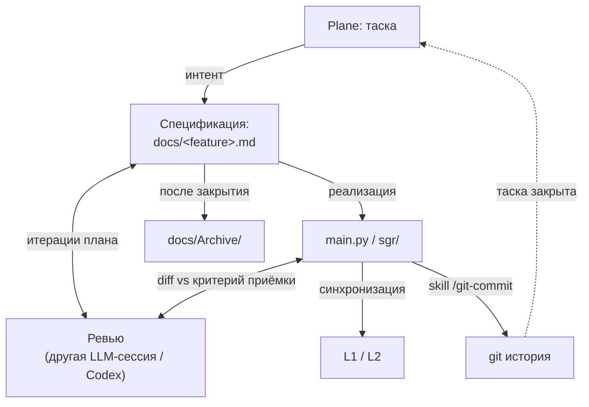

# Методология: персональный Spec-Driven Development

## Принцип

Спецификация пишется до кода и содержит критерий приёмки. Код — источник правды для текущего состояния, спецификация — источник правды для намерения.

Один цикл = одна таска Plane = один Human plan файл в `docs/` = один коммит. Цикл закрывается за одну сессию.

---

## Артефакты документации

### Постоянные (живут в `docs/`)

| Файл | Содержит | Когда обновляется |
|---|---|---|
| `B0-context.md` | Бизнес-контекст: цель, типы документов, реквизиты, известные ограничения | При смене бизнес-целей или scope |
| `L1-architecture.md` | Архитектура системы: компоненты, внешние системы, потоки данных | При структурных изменениях (добавлен компонент, поменялась интеграция) |
| `L2-functions.md` | Функции скрипта: входы, выходы, ветвления | После каждого изменения кода, затрагивающего контракт или логику функции |

### Временные

Один файл на одну фичу/таску с произвольным понятным именем (`enrich-rework.md`, `reactive-soaring-muffin.md`). Структура: **Контекст → Этапы → Валидация** (с `✅` по мере прохождения). Эталон — [Archive/docker-deploy.md](Archive/docker-deploy.md). После закрытия таски переезжает в `docs/Archive/`.

---

## Цикл архитектурного изменения

1. **Sensemaking** — со-discovery с агентом  до понимания: что меняем, зачем, как оно будет работать.
2. **Human Plan** — аналитический мост между бизнес-интентом и кодом. Уровень: компоненты, потоки, правила, состояния, последствия, проверка. Без кода и псевдокода.
3. **Human Plan Review** — независимое ревью Human Plan на дыры, противоречия и неясный scope. Можно несколько раундов, пока замечания не становятся мелочными.
4. **Agent Plan** — финальный технический план в чате, разрабатывается агентом в `plan mode` на основании Human Plan. Ниже уровень абстракции; можно файлы, функции, тесты, порядок внедрения. Отдельно не ревьюится.
5. **Implementation** — агент пишет код по Agent Plan.
6. **Implementation Review/Validate** — другой агент проверяет реализацию, пользователь руками или агентом проверяет фичу.
7. **Doc Sync / Commit / Close Task** — синхронизация документации (`/doc-sync-review`), коммит (`/git-commit`), закрытие таски в Plane.

Критерий качества Human Plan — устойчивая ментальная модель фичи: что входит, что происходит внутри, какие решения приняты, где границы, какие ошибки возможны, как увидеть рабочий результат.

---

## Скиллы по этапам

| Этап | Скилл | Агент | Что делает |
|---|---|---|---|
| Human Plan | `/human-plan` | Claude | Пишет аналитический мост между интентом и кодом |
| Human Plan Review | `/human-plan-review` | Codex | Проверяет Human Plan до реализации: дыры, противоречия, неясный scope, варианты решений |
| Реализация (`.py` файлы) | `/dignified-python` | Codex | Правила стиля и качества Python-кода |
| Implementation Review | `/implementation-review` | Claude | Проверяет реализацию против Human Plan, Agent Plan, тестов и качества кода |
| Синхронизация документации | `/doc-sync-review` | Claude/Codex | Актуализирует L1/L2/README после изменений |
| Коммит | `/git-commit` | Claude/Codex | Оформляет коммит по правилам проекта |

---

## Карта артефактов

Ревью на двух точках контроля (Human Plan и diff кода) — другая LLM-сессия или Codex. Agent Plan — финальный технический план реализации, отдельно не ревьюится.
