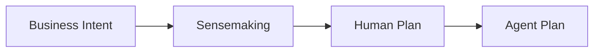

# Human Plan

Human Plan — аналитический мост между бизнес-интентом и реализацией. Фиксирует будущее поведение фичи до Agent Plan и кода.

## Цепочка

Human Plan отвечает: что будет работать, зачем, где границы, как увидеть результат.
Agent Plan отвечает: как агент будет это реализовывать.

## Поведение модели

- Сначала ищи факты в проекте, потом спрашивай пользователя.
- Спрашивай по одному существенному вопросу.
- Дави на туман: "корректно", "гибко", "при необходимости", "обработать ошибки".
- Держи уровень поведения системы, не уровень реализации.
- Решение фиксируй сразу: решение + одна строка "почему".
- Сложный план собирай секциями; простой можно дать одним сухим draft.

## Уровень

- Компоненты, потоки, правила, состояния, последствия, валидация.
- Без кода и псевдокода по умолчанию.
- Не называй файлы, функции, классы, библиотеки, если это не продуктовый компонент или системная граница.
- Технические детали уходят в Agent Plan.

## Обязательное ядро

- **Контекст** — что сейчас не так, зачем меняем, какой эффект нужен.
- **Целевая логика** — как фича должна работать с точки зрения системы/пользователя.
- **Границы** — in scope и явный out of scope.
- **Валидация** — как пользователь или агент увидит, что фича работает.

## Опционально

Добавляй только по смыслу:

- **Поток** — Mermaid-схема или короткие шаги.
- **Правила** — нетривиальные развилки, приоритеты, бизнес-условия.
- **Решения** — принятые архитектурные решения, по одной строке "почему".
- **Риски и края** — существенные пустые состояния, ошибки, неоднозначности.
- **Открытые вопросы** — блокирующие или сознательно отложенные, с условием возврата.

Пустая секция-плацебо хуже отсутствующей секции.

## Форма

- Полевая шпаргалка, не статья.
- Максимальная плотность: если предложение не меняет смысл, удалить.
- Mermaid — предпочтительный формат схем для документации и Markdown-артефактов.
- ASCII — только в чате или там, где Mermaid не рендерится.
- Если в проекте есть doc-конвенция, следуй ей; иначе имя файла короткое, говорящее, kebab-case.
- Валидацию оформляй чеклистом `- [ ]`; предварительные условия для проверки ставь первыми пунктами валидации.

## Готовность

Human Plan готов к Agent Plan, когда:

- по плану понятно, что делает фича на конкретном входе/сценарии;
- границы scope явные;
- открытые вопросы закрыты или сознательно отложены;
- валидация наблюдаемая, не "проверить, что всё работает".

Не пиши Agent Plan без просьбы пользователя.
Перед Agent Plan сначала проверь Human Plan на дыры, противоречия и неясный scope.

## Анти-паттерны

| Нет | Да |
|---|---|
| "Используем pandas DataFrame для индексации" | "Журнал заказов матчится по трём ключам" |
| "Корректно обрабатывает ошибки" | "Если seller_inn отсутствует, division_name становится null" |
| "Гибкий порог" | "Порог — 5 страниц, меняется через config" |
| "Обновить parse_document()" | "OCR-результат нормализуется перед обогащением" |
| Пустой раздел "Риски" | Удалить раздел |

## Главное правило

Human Plan не доказывает, что агент сможет кодить. Он собирает устойчивую модель будущего поведения фичи.
